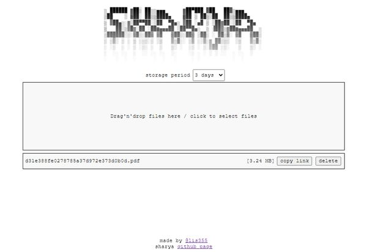

# sharya - light NodeJS/React web sharing server



Small server to share files via short urls

NodeJS server requires engine `>=v22.8.0` to support sqlite-native library

Files stored in local folder, information stored in SQLite database

For each upload server generates 4-symbol string, unique short id

User can upload files and delete own uploads, server get to every user token (random 32-hex string), which allow to do these operation

## Build & run

Build frontend react static build

```
cd client-react
yarn run build
```

Then, run server

```
cd server-nodejs
node --experimental-sqlite src/main.js
```

All settings (base url, ports) stored in .env files, you can create overrides by making `.env.local` files
